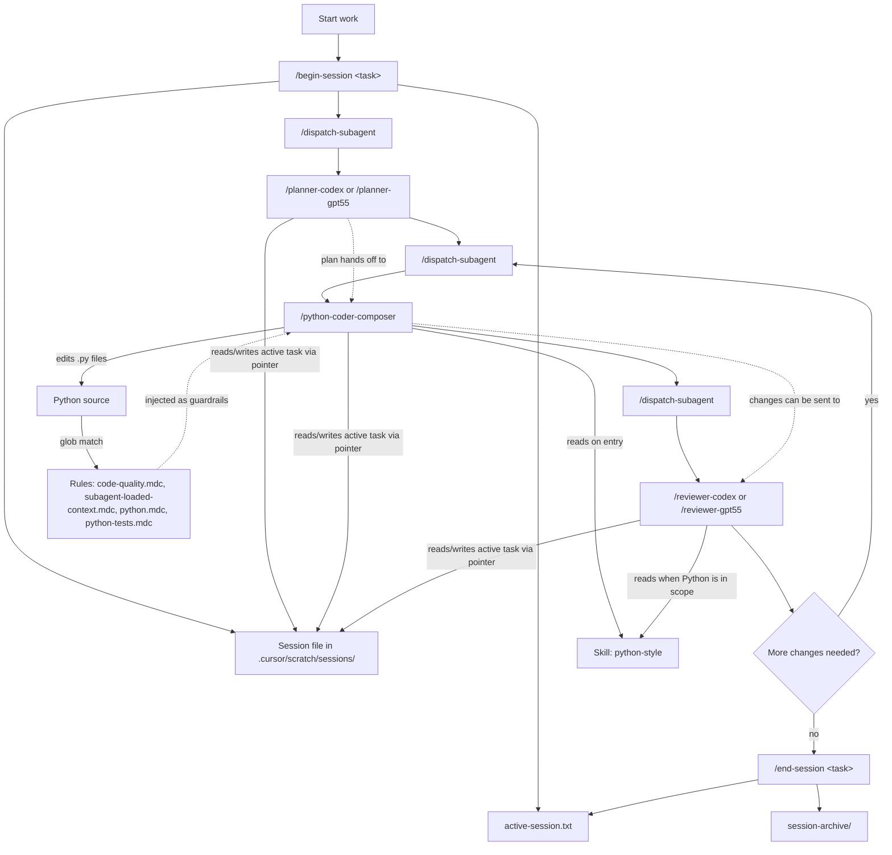

# CouchPilot

CouchPilot is a small, opinionated Cursor setup for planning, coding, and
reviewing Python work with less prompt babysitting.

Clone it, run one sync script, and your user-level Cursor config gets a compact
set of rules, skills, subagents, and slash commands. There is no package to
install, no wrapper CLI, and no project-level files to copy into every repo.

## TL;DR

```bash
git clone <this-repo> CouchPilot
cd CouchPilot
python sync.py
```

Then restart Cursor, open a Python project, and use the loop:

```text
/begin-session task: feat-foo-module implement foo workflow
/dispatch-subagent /planner-codex task: feat-foo-module plan the implementation
/dispatch-subagent /python-coder-composer task: feat-foo-module execute the plan
/dispatch-subagent /reviewer-gpt55 task: feat-foo-module review the changes
/end-session task: feat-foo-module completed
```

Re-run `python sync.py` whenever you change this repo's `.cursor/` files. Use
`python sync.py --dry-run` to preview what would change.

## What This Is For

CouchPilot gives Cursor a reusable working style:

- Start a task with a clear task ID.
- Dispatch a planner for a concrete implementation plan.
- Dispatch that plan to a Python-focused coding subagent.
- Dispatch the diff to a reviewer subagent.
- Keep the handoff notes in simple scratch files instead of re-explaining the
  task every time.

The goal is not to build a heavy agent framework. It is a lightweight personal
toolkit for keeping Cursor's help consistent across machines and projects.

## What's Included

```text
CouchPilot/
  .cursor/
    rules/
      code-quality.mdc
      subagent-loaded-context.mdc
      python.mdc
      python-tests.mdc
    skills/
      python-style/SKILL.md
    agents/
      planner-codex.md
      planner-gpt55.md
      python-coder-composer.md
      reviewer-codex.md
      reviewer-gpt55.md
    commands/
      begin-session.md
      end-session.md
      dispatch-subagent.md
      deslop-main-diff.md
      deslop-workspace.md
  sync.py
  README.md
```

After sync, those files are copied into `~/.cursor/`, where Cursor can use them
from any workspace.

### Rules

Rules are short guardrails Cursor can inject automatically.

- `code-quality.mdc` applies globally and keeps edits minimal, idiomatic, and
  low-noise.
- `subagent-loaded-context.mdc` applies globally and requires subagents to
  announce their active subagent identity, rules, and skills before task work.
- `python.mdc` applies to `*.py` files and captures the Python style and
  tooling baseline.
- `python-tests.mdc` applies to Python test files and adds pytest conventions.

### Skill

`python-style` is the longer "code the way I write code" reference. The Python
coder reads it before implementation work, and reviewers consult it when Python
is in scope.

### Subagents

| Subagent | Role | Model |
|---|---|---|
| `/planner-codex` | Produce an implementation plan without editing code. | `gpt-5.3-codex` |
| `/planner-gpt55` | Produce an implementation plan tuned for GPT-5.5. | `gpt-5.5` |
| `/python-coder-composer` | Implement Python changes after inspecting the project. | `composer-2` |
| `/reviewer-codex` | Review a diff with line-anchored findings. | `gpt-5.3-codex` |
| `/reviewer-gpt55` | Review a diff with risk-first GPT-5.5 behavior. | `gpt-5.5` |

If your Cursor install exposes different model slugs, edit the `model:` line in
the relevant agent file and run `python sync.py` again.

### Commands

- `/begin-session` starts or switches the active task.
- `/end-session` archives the active task and clears the pointer.
- `/dispatch-subagent` is the required path for planner, coder, and reviewer
  subagent work. It carries the handoff structure and prompt metadata the parent
  agent needs when delegating.
- `/deslop-main-diff` runs an optional cleanup pass over branch changes.
- `/deslop-workspace` runs an optional cleanup pass across the workspace.

## Daily Workflow

Use one task ID for the whole loop. A short kebab-case slug works well:
`task: feat-foo-module`. After the session starts, always call planner, coder,
and reviewer subagents through `/dispatch-subagent`.

1. Start the task.

   ```text
   /begin-session task: feat-foo-module implement foo workflow
   ```

2. Plan the work.

   ```text
   /dispatch-subagent /planner-codex task: feat-foo-module add a Foo class that reads foo.json and exposes get(key)
   ```

3. Implement the plan.

   ```text
   /dispatch-subagent /python-coder-composer task: feat-foo-module execute the approved plan
   ```

4. Review the diff.

   ```text
   /dispatch-subagent /reviewer-gpt55 task: feat-foo-module review the latest changes
   ```

5. Iterate if needed.

   ```text
   /dispatch-subagent /python-coder-composer task: feat-foo-module address the review findings
   ```

6. End the task.

   ```text
   /end-session task: feat-foo-module completed and merged
   ```

Always use `/dispatch-subagent` for subagent work. It keeps the parent chat
acting as a dispatcher and passes the task-specific sections and prompt metadata
the target subagent needs:

```text
/dispatch-subagent /python-coder-composer task: feat-foo-module address the review findings
```

## How the Pieces Fit Together



Think of the four Cursor pieces this way:

- Rules are reflexes.
- Skills are reference notes.
- Subagents are focused coworkers.
- Commands are explicit controls for starting, delegating, and closing work.

## Scratch Files

Subagents are one-shot workers. They do not automatically remember what another
subagent did earlier, so CouchPilot uses plain markdown scratch files as the
handoff record.

- Active pointer: `.cursor/scratch/active-session.txt`
- Task notes: `.cursor/scratch/sessions/*.md`
- Tooling cache: `.cursor/scratch/tooling.md`

The Python coder may create `.cursor/scratch/tooling.md` in a target project to
remember the formatter, linter, type checker, and test command it discovered.
The scratch directory also gets its own `.gitignore`, so these notes stay local.

This is intentionally not vector memory, semantic search, or cross-project
learning. It is just one task at a time in markdown.

## After Sync

Cursor can cache user-scope rules, skills, agents, and commands per chat
session. After running `sync.py`, restart Cursor or at least open a fresh chat
in a new window.

Each synced subagent is instructed to announce its active subagent identity,
rules, and skills before starting work. A healthy Python run looks roughly like:

```text
Loaded: subagent = python-coder-composer; rules = code-quality.mdc, subagent-loaded-context.mdc, python.mdc, python-tests.mdc; skills = python-style
```

If `python.mdc` or `python-tests.mdc` is missing, make sure a matching Python
file is open or attached. Glob-scoped rules only appear when relevant files are
in context.

## Extending It

To add another language, copy the same pattern:

1. Add a language rule, such as `.cursor/rules/typescript.mdc`.
2. Add a style skill, such as `.cursor/skills/typescript-style/SKILL.md`.
3. Add a focused coder subagent, such as `.cursor/agents/typescript-coder.md`.
4. Run `python sync.py`.

Keep names specific enough that they do not collide with everyday slash command
usage. For example, prefer `/python-coder-composer` over `/python`.

## Intentionally Not Included

CouchPilot keeps the surface area small on purpose:

- No installable Python package or wrapper CLI.
- No project-scope sync into target repos.
- No persistent memory system.
- No `.couchpilot/tasks/` workspace.
- No formatter or linter config templates for target projects.
- No subagents beyond the current planner, coder, and reviewer set.

Add more only when a real workflow need earns the extra complexity.
