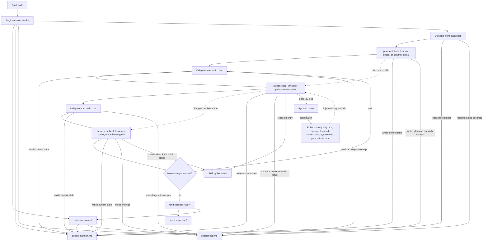

# CouchPilot

CouchPilot is a small, opinionated Cursor setup for planning, coding, and
reviewing Python work with less prompt babysitting.

Clone it, run one sync script, and your user-level Cursor config gets a compact
set of rules, skills, subagents, and slash commands. There is no package to
install, no wrapper CLI, and no project-level files to copy into every repo.

## TL;DR

```bash
git clone <this-repo> CouchPilot
cd CouchPilot
python sync.py
```

Then restart Cursor, open a Python project, and use the loop:

```text
/begin-session task: feat-foo-module implement foo workflow; include goals, constraints, and acceptance criteria here
# Then delegate from the main chat. The dispatcher curates prompts from current-handoff.md plus targeted session-log.md excerpts.
/end-session task: feat-foo-module completed
```

Re-run `python sync.py` whenever you change this repo's `.cursor/` files. Use
`python sync.py --dry-run` to preview what would change.

## What This Is For

CouchPilot gives Cursor a reusable working style:

- Start a task with a clear task ID.
- Delegate to a planner for a concrete implementation plan.
- Delegate that plan to a Python-focused coding subagent.
- Delegate the diff to a reviewer subagent.
- Keep the current handoff and historical session log in simple scratch files
  instead of re-explaining the task every time.

The goal is not to build a heavy agent framework. It is a lightweight personal
toolkit for keeping Cursor's help consistent across machines and projects.

## What's Included

```text
CouchPilot/
  .cursor/
    rules/
      code-quality.mdc
      subagent-loaded-context.mdc
      python.mdc
      python-tests.mdc
    skills/
      python-style/SKILL.md
    agents/
      planner-inherit.md
      planner-codex.md
      planner-gpt55.md
      python-coder-codex.md
      python-coder-inherit.md
      reviewer-inherit.md
      reviewer-codex.md
      reviewer-gpt55.md
    commands/
      begin-session.md
      end-session.md
      deslop-main-diff.md
      deslop-workspace.md
  sync.py
  README.md
```

After sync, those files are copied into `~/.cursor/`, where Cursor can use them
from any workspace.

### Rules

Rules are the automatic guardrail layer. They are intentionally short because
they may be injected whenever their metadata matches the current context.

- `code-quality.mdc` applies globally and keeps edits minimal, idiomatic, and
  low-noise.
- `subagent-loaded-context.mdc` applies globally and requires subagents to
  announce their active subagent identity, rules, and skills before task work.
- `python.mdc` applies to `*.py` files and captures the Python style and
  tooling baseline.
- `python-tests.mdc` applies to Python test files and adds pytest conventions.

### Skill

`python-style` is the longer "code the way I write code" reference. It is marked
with `disable-model-invocation: true`, so it should not be auto-selected just
because Python is nearby. Python subagents read it explicitly when they need the
deeper style guide.

Rule vs skill distinction in CouchPilot:

- Rules are compact defaults that can be automatically attached.
- Skills are longer references that should be read deliberately.
- If guidance must always be present for Python code, keep it in `python.mdc`.
- If guidance is detailed rationale or reporting convention, keep it in the
  explicit skill.

### Subagents

| Subagent | Role | Model |
|---|---|---|
| `/planner-inherit` | Fast bounded planning for clear tasks. | `inherit` |
| `/planner-codex` | Middle-ground structured planning for moderate complexity. | `gpt-5.3-codex` |
| `/planner-gpt55` | Deep planning for ambiguous or high-risk work. | `gpt-5.5` |
| `/python-coder-codex` | Careful Python implementation for complex changes. | `gpt-5.3-codex` |
| `/python-coder-inherit` | Implement Python changes after inspecting the project. | `inherit` |
| `/reviewer-inherit` | Fast review for low-risk changes. | `inherit` |
| `/reviewer-codex` | Review a diff with line-anchored findings. | `gpt-5.3-codex` |
| `/reviewer-gpt55` | Review a diff with risk-first GPT-5.5 behavior. | `gpt-5.5` |

If your Cursor install exposes different model slugs, edit the `model:` line in
the relevant agent file and run `python sync.py` again.

### Commands

- `/begin-session` starts or switches the active task, creates a session
  directory with `current-handoff.md` and `session-log.md`, and defines
  **Delegation to subagents** (how the main chat delegates to planner, coder, or
  reviewer).
- `/end-session` archives the active session directory and clears the pointer.
- `/deslop-main-diff` runs an optional cleanup pass over branch changes.
- `/deslop-workspace` runs an optional cleanup pass across the workspace.

## Daily Workflow

Use one task ID for the whole loop. A short kebab-case slug works well:
`task: feat-foo-module`. Put the durable task context in `/begin-session`:
goals, constraints, acceptance criteria, relevant notes, and messy-but-useful
task rambling. After the session starts, follow **Delegation to subagents** in
`/begin-session` when delegating from the main chat. The main dispatcher reads
`current-handoff.md` first, pulls only targeted `session-log.md` excerpts when
needed, and keeps delegated prompts task-only (`Goal`, `Scope`, …).

1. Start the task.

   ```text
   /begin-session task: feat-foo-module implement foo workflow; reads foo.json; expose get(key); preserve current callers; add pytest coverage
   ```

2. Plan the work (main chat: e.g. invoke `/planner-inherit` with structured handoff per `/begin-session` → Delegation).

   ```text
   /planner-inherit   # task: feat-foo-module — plan the implementation (Goal, Scope, Acceptance, Gates, Report, Session intent)
   ```

3. Implement the plan.

   ```text
   /python-coder-inherit   # task: feat-foo-module — execute the approved plan
   ```

4. Review the diff.

   ```text
   /reviewer-codex   # task: feat-foo-module — review the latest changes
   ```

5. Iterate if needed.

   ```text
   /python-coder-inherit   # task: feat-foo-module — address the review findings
   ```

6. End the task.

   ```text
   /end-session task: feat-foo-module completed and merged
   ```

Keep each delegated prompt short: use the section list in `/begin-session` ->
**Delegation to subagents**. If the full brief should be visible to every
subagent, keep it in `session-log.md` via `/begin-session`; in the delegated
message, carry only what that hop needs beyond the curated handoff and active
plan excerpt.

## Workflow Examples

These are example routes, not automatic choices. The user chooses which subagent
to use each time. If delegation is requested without exactly one target subagent
name, the parent should ask for clarification instead of selecting a route.

### Default Balanced

Use for normal Python work where the scope is clear or moderately complex:

```text
/planner-inherit -> /python-coder-inherit -> /reviewer-codex
```

Best for feature work, small refactors, tests, known bugs, and well-understood
behavior updates. Avoid for architecture, security, infrastructure, concurrency,
or vague tasks.

Examples: add schema validation, extract a shared helper, add pytest coverage,
or fix a known background job state bug.

Rationale: Inherit keeps planning and implementation on the parent’s model route;
Codex gives the final review more depth.

### Serious / High-Risk

Use when a bad implementation would be expensive to unwind:

```text
/planner-gpt55 -> /python-coder-codex -> /reviewer-codex
```

Best for architecture changes, multi-file refactors, async workflows, job
orchestration, migrations, security-sensitive work, and production-risk changes.
Avoid for cleanup, formatting, one-file fixes, or docs-only updates.

Examples: redesign a worker pipeline, change deployment behavior, add migration
logic, or add concurrency controls around job processing.

Rationale: GPT-5.5 spends more effort on planning trade-offs while Codex handles
careful implementation and review.

### Cheap / Fast Iteration

Use when the task is small, obvious, low-risk, and easy to inspect manually:

```text
/planner-inherit -> /python-coder-inherit -> /reviewer-inherit
```

Best for docs, simple tests, lint fixes, type hint cleanup, docstrings,
mechanical renames, and one-file changes. Avoid for production risk, complex
logic, credentials, deployment, concurrency, or migrations.

Examples: update README guidance, add a missing docstring, rename a helper, fix a
lint complaint, or test an existing pure function.

Rationale: Inherit across the loop keeps simple iteration cheap and quick.

## How the Pieces Fit Together



Think of the four Cursor pieces this way:

- Rules are reflexes.
- Skills are reference notes.
- Subagents are focused coworkers.
- Commands are explicit controls for starting and closing work; delegation rules live in `/begin-session`.

## Scratch Files

Subagents are one-shot workers. They do not automatically remember what another
subagent did earlier, so CouchPilot uses plain markdown scratch files as the
handoff record. The current state is split from the historical log so most
dispatches do not need to carry the whole session history.

- Active pointer: `.cursor/scratch/active-session.txt`
- Current handoff: `.cursor/scratch/sessions/<session-id>/current-handoff.md`
- Session log: `.cursor/scratch/sessions/<session-id>/session-log.md`
- Ended sessions: `.cursor/scratch/session-archive/<session-id>/`
- Tooling cache: `.cursor/scratch/tooling.md`

**Workflow ownership:** slash commands own orchestration and pointer changes. In
particular, `/begin-session` creates the session scaffold, maintains
`.cursor/scratch/active-session.txt`, ensures scratch is ignored by git, and
defines **Delegation to subagents** (handoff sections, clarification gate, and
parent-thread output contract for planner/coder/reviewer).
The main dispatcher reads the pointer and `current-handoff.md`, optionally reads
targeted excerpts from `session-log.md`, then passes a curated prompt to exactly
one subagent. Subagents trust that curated prompt by default; they reread
handoff/log files only for fallback, direct invocation, conflicts, or safe merge
before writing. Subagents do not edit the pointer or recreate session
infrastructure.

Within the split session files, planners update `current-handoff.md` and write
`session-log.md#plan` plus concise `# Dispatch recommendations`; coders update
`current-handoff.md` and append to implementation/project/iteration sections in
`session-log.md`; reviewers update `current-handoff.md` and write
`session-log.md#findings`.

The Python coder may create `.cursor/scratch/tooling.md` in a target project to
remember the formatter, linter, type checker, and test command it discovered.
`/begin-session` keeps `.cursor/scratch/` ignored by the target repo, and the
scratch directory also gets its own `.gitignore`.

This is intentionally not vector memory, semantic search, or cross-project
learning. It is just one task at a time in markdown, with a small current
handoff and a separate audit log.

## After Sync

Cursor can cache user-scope rules, skills, agents, and commands per chat
session. After running `sync.py`, restart Cursor or at least open a fresh chat
in a new window.

Each synced subagent is instructed to announce its active subagent identity,
rules, and skills before starting work. A healthy Python run looks roughly like:

```text
Loaded: subagent = python-coder-inherit (inherit); rules = code-quality.mdc, subagent-loaded-context.mdc, python.mdc, python-tests.mdc; skills = python-style
```

If `python.mdc` or `python-tests.mdc` is missing, make sure a matching Python
file is open or attached. Glob-scoped rules only appear when relevant files are
in context.

## Extending It

To add another language, copy the same pattern:

1. Add a language rule, such as `.cursor/rules/typescript.mdc`.
2. Add a style skill, such as `.cursor/skills/typescript-style/SKILL.md`.
3. Add a focused coder subagent, such as `.cursor/agents/typescript-coder.md`.
4. Run `python sync.py`.

Keep names specific enough that they do not collide with everyday slash command
usage. For example, prefer `/python-coder-inherit` over `/python`.

## Intentionally Not Included

CouchPilot keeps the surface area small on purpose:

- No installable Python package or wrapper CLI.
- No project-scope sync into target repos.
- No persistent memory system.
- No `.couchpilot/tasks/` workspace.
- No formatter or linter config templates for target projects.
- No non-Python coder templates.

Add more only when a real workflow need earns the extra complexity.
