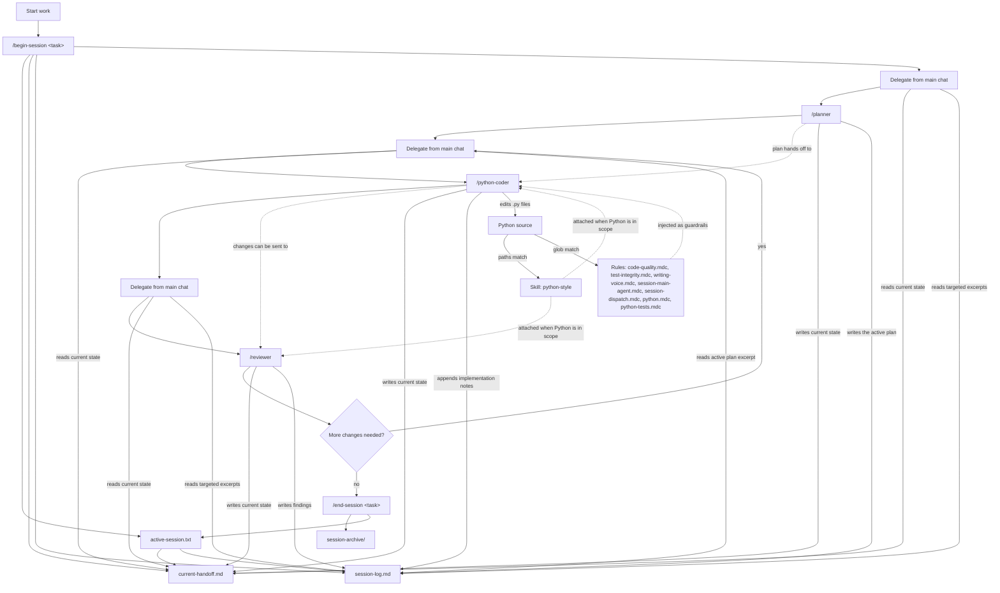

# CouchPilot

CouchPilot is a small, opinionated Cursor setup for planning, coding, and
reviewing Python work with less prompt babysitting.

Clone it, run one sync script, and your user-level Cursor config gets a compact
set of rules, skills, subagents, and slash commands. There is no package to
install, no wrapper CLI, and no project-level files to copy into every repo.

## TL;DR

```bash
git clone <this-repo> CouchPilot
cd CouchPilot
python sync.py
```

Then restart Cursor, open a Python project, and use the loop:

```text
/task-brief <paste raw task notes if you want CouchPilot to distill them first>
/begin-session task: feat-foo-module implement foo workflow; include goals, constraints, and acceptance criteria here
# Or: /begin-session use previous task brief
# Then delegate from the main chat. The dispatcher curates prompts from current-handoff.md plus targeted session-log.md excerpts.
/end-session task: feat-foo-module completed
```

Re-run `python sync.py` whenever you change this repo's `.cursor/` files. Use
`python sync.py --dry-run` to preview, and `python sync.py --prune` to delete
files an earlier sync installed that CouchPilot no longer ships.

## What This Is For

CouchPilot keeps task context **on disk instead of in the chat window**.

A long Cursor chat accumulates the task description, the plan, every
implementation detail, and every review finding — all re-sent on every turn.
When the window fills, Cursor retraces the conversation to summarize it, and
token usage spikes precisely when the chat is already at its most expensive. On
a costly model, one unnoticed retrace can burn a real slice of a monthly
allocation.

The loop avoids that by keeping the durable record in markdown:

- Start a task with a clear task ID.
- Delegate to a planner for a concrete implementation plan.
- Delegate that plan to a Python-focused coding subagent.
- Delegate the diff to a reviewer subagent.
- Each subagent reads only what it needs from `current-handoff.md`, does one
  job in its own fresh context, writes its result back to disk, and exits.

The main chat stays a thin dispatcher. It never holds the implementation
transcript, so it stays usable far longer before approaching the limit.

**This is why subagents require an active session and refuse to run without
one.** It is not a safety rail that can be waived for convenience. A dispatch
with no session has no handoff to read and nowhere to write its result — it is
an expensive way to do what the main chat could have done directly, and it
defeats the reason the system exists.

The goal is not a heavy agent framework. It is a small personal toolkit for
keeping long Python work affordable and consistent across machines.

## When Not To Use It

CouchPilot is for work long enough that context management pays for itself.

For a quick question, a one-file fix, or anything that will not come close to
filling the window, skip it. Open a chat and ask. With no active session both
session rules go inert, the main chat writes code directly, and `python.mdc`
plus the `python-style` skill still attach to any `*.py` file — so you keep
every guardrail and pay none of the ceremony.

Rough test: if you would not mind re-explaining the task from scratch after a
context reset, you do not need a session.

## What's Included

```text
CouchPilot/
  .cursor/
    rules/
      code-quality.mdc
      test-integrity.mdc
      writing-voice.mdc
      session-main-agent.mdc
      session-dispatch.mdc
      session-files.mdc
      python.mdc
      python-tests.mdc
    skills/
      python-style/SKILL.md
      test-integrity/SKILL.md
      plainspoken-writing/SKILL.md
    agents/
      planner.md
      python-coder.md
      reviewer.md
    commands/
      task-brief.md
      begin-session.md
      end-session.md
      audit-test-integrity.md
      deslop-main-diff.md
      deslop-workspace.md
  sync.py
  README.md
```

Sync records what it installed in `~/.cursor/.couchpilot-manifest.json`. On the
next run it reports any file it placed previously but no longer ships, and
`--prune` deletes those. Only files the manifest claims are ever removed, so
hand-written config in `~/.cursor/` is never touched. The first run after
adopting the manifest establishes the baseline and prunes nothing.

After sync, those files are copied into `~/.cursor/`, where Cursor can use them
from any workspace.

### Rules

Rules are the automatic guardrail layer. They are intentionally short because
they may be injected whenever their metadata matches the current context.

- `code-quality.mdc` applies globally and keeps edits minimal, idiomatic, and
  low-noise.
- `test-integrity.mdc` applies globally and stops the agent from treating the
  test suite as the specification. It is deliberately short: only the part that
  has to fire without being asked. The vocabulary, worked examples, and
  reporting contract live in the `test-integrity` skill.
- `writing-voice.mdc` applies globally and governs everything that is not code:
  docstrings, comments, commit messages, docs, and chat replies.
- `session-main-agent.mdc` applies globally and defines what the main chat may
  do during a session: dispatch, Q&A, and session curation only.
- `session-dispatch.mdc` applies globally and owns the delegated-prompt
  structure, clarification gate, specialist-scope check, and parent-thread
  output contract.
- `session-files.mdc` applies globally and owns how session files are read and
  written. It is the one session rule that governs subagents too, because they
  are the ones writing those files.

`session-main-agent.mdc` and `session-dispatch.mdc` say so in their own text:
they are parent-thread rules, and a subagent that receives them should ignore
them. Cursor has no per-agent rule scoping, so an `alwaysApply` rule reaches
every subagent whether or not it is meant for one. The disclaimer stops
misapplication; it does not stop the injection.

All session rules are **explicitly inert** when no session is active. With no
`.cursor/scratch/active-session.txt`, or a `task_id` of `(none)`, the main chat
behaves like any other Cursor chat — including writing code directly. The
lifecycle only engages once you run `/begin-session`.
- `python.mdc` applies to `*.py` files and captures the Python style and
  tooling baseline.
- `python-tests.mdc` applies to Python test files and adds pytest conventions.

Every rule ends with a plain `Rule id:` line (`Rule id: py-1`). Subagents echo
the ids they can see, which is how you tell an attached rule from one the agent
merely assumed. Keep these as visible text — an HTML comment (`<!-- ... -->`) at
the top level of an `.mdc` file stops Cursor registering the rule at all.

### Skills

`plainspoken-writing` is the worked-examples layer for `writing-voice.mdc`, with
before/after pairs for docstrings, comments, commit messages, agent reports, and
chat replies. It carries `paths: "**/*.py,**/*.md,**/*.rst,**/*.txt"` and ends
with `Skill id: pw-1`.

`python-style` is the worked-examples layer for the Python rule: BAD/GOOD pairs keyed
to pylint message codes, docstring conventions, and the anti-patterns pylint
cannot catch. It carries `paths: "**/*.py"`, so Cursor attaches it when Python
files are in scope. It ends with `Skill id: pys-1`.

`test-integrity` is the worked-examples layer for the test-integrity rule:
Python BAD/GOOD pairs for hardcoded fixture values, test-environment branches,
special cases standing in for an invariant, weakened assertions, and mocking the
unit under test. It also covers the two cases agents avoid using, `incorrect-test`
and `architecture-conflict`. It carries `paths: "**/*.py"` and ends with
`Skill id: tis-1`.

The Python guidance is pylint-first by design — pylint's strict feedback loop is
the authoring standard even in projects that gate on ruff. Message codes give
the agent something checkable (`R0912`) instead of an adjective ("keep it
simple"). Caps are pylint stock defaults at line length 100.

Rule vs skill distinction in CouchPilot:

- Rules are compact defaults, kept under Cursor's ~50-line guidance.
- Skills are longer references for detail that would bloat a rule.
- If guidance must always be present for Python code, keep it in `python.mdc`.
- If guidance is detailed rationale or reporting convention, keep it in the
  skill.

### Where guidance belongs

Every layer has a different resident cost, so put guidance in the most
conditional one that still fires when it has to:

| Layer | Paid when | Use for |
|---|---|---|
| Subagent file | Only when that subagent is dispatched | Role-specific process and reporting duties |
| Skill with `paths:` | Only when a matching file is in context | Worked examples, vocabulary, long reference |
| Rule with `globs:` | Only when a matching file is in context | Language contracts that need no prompting |
| Rule with `description:` only | Description line always; body when the agent asks | Guidance the agent can reliably recognize it needs |
| Rule with `alwaysApply: true` | Every turn, every project | Reflexes that must fire before the agent knows it needs them |

An always-on rule is the most expensive slot you have. Two things earn it: the
guidance must apply with no file in context, and the agent must be unable to
recognize on its own that it needs it. `test-integrity.mdc` qualifies on both
counts, which is why it stays global and why it stays short. A rule the agent
would correctly ask for belongs in the description-only tier instead.

The dispatcher is usually the wrong place. `session-main-agent.mdc` and
`session-dispatch.mdc` are always-on, so anything added there is paid on every
turn including plain Q&A. Default to pushing guidance down to the subagent.

One thing does earn a dispatcher slot: a check that prevents a subagent from
launching at all. The specialist-scope check in `session-dispatch.mdc` costs six
resident lines and saves a whole dispatch every time the named specialist does
not match the languages in scope. Guidance that only shapes a run belongs in the
subagent; guidance that cancels a run has to happen before the run exists.

### Using a specialist outside its language

Nothing stops you from dispatching `/python-coder` at a Terraform, YAML, or SQL
change, and sometimes that is the right call. What you lose is silent:
`python.mdc` and `python-style` are path-scoped and simply never attach, so the
run keeps `code-quality.mdc`, `writing-voice.mdc`, and `test-integrity.mdc` and
nothing else.

The coder now names the mismatch on entry and asks before proceeding, then
repeats the caveat in its report. That is cheaper than a general-purpose coder
rule, which would be resident on every turn to catch a case that comes up rarely
and would overlap with `python.mdc` where they agree.

### Subagents

| Subagent | Role |
|---|---|
| `/planner` | Turn a request into an execution strategy a coder can run without re-discovery. |
| `/python-coder` | Implement the assigned plan or slice and run the project's real quality gates. |
| `/reviewer` | Review the diff for correctness and risk; produce line-anchored findings and one verdict. |

All three use `model: inherit`, so each runs whatever model the parent chat is
set to. **Choose depth with the model picker before you dispatch** — pin the
parent to a specific model rather than leaving it on Auto, or `inherit` just
gives you whatever Auto selected.

A subagent that stops to ask a question can be **resumed with its context
intact** rather than re-dispatched from scratch. Observed in practice: a coder
blocked on entry over a language mismatch, got an operator yes through the
dispatcher, and continued straight to the edit. That makes "stop and ask" cheap,
so an instruction telling a subagent to halt for a decision costs little beyond
the answer itself. It does not make subagents remember each other. A resumed
agent is the same run continuing, not a new agent inheriting history.

This replaced an earlier per-model agent set (`planner-codex`, `planner-gpt55`,
and so on). Hard-coding model slugs in agent files meant they silently pointed
at models that no longer existed, and every dispatch quietly fell back to the
same model regardless of which "tier" was chosen.

### Commands

- `/task-brief` distills raw task rambling into `.cursor/scratch/task-brief.md`
  without starting or changing an active session.
- `/begin-session` starts or switches the active task and creates a session
  directory with `current-handoff.md` and `session-log.md`. The dispatch
  contract itself lives in the `session-main-agent` rule.
- `/end-session` archives the active session directory and clears the pointer.
- `/audit-test-integrity` runs a read-only audit for code shaped to pass tests
  and writes a remediation list to `.cursor/scratch/test-integrity-audit.md`.
- `/deslop-main-diff` runs an optional cleanup pass over branch changes.
- `/deslop-workspace` runs an optional cleanup pass across the workspace.

## Daily Workflow

Use one task ID for the whole loop. A short kebab-case slug works well:
`task: feat-foo-module`. If your starting point is messy, run `/task-brief`
first and paste the raw notes; it will derive a suggested slug, problem,
outcome, constraints, acceptance criteria, files/links, risks, and open
questions. Then start the session with either explicit context or the latest
brief. After the session starts, the `session-main-agent` rule governs
delegation from the main chat. The dispatcher reads `current-handoff.md` first,
pulls only targeted `session-log.md` excerpts when needed, and keeps delegated
prompts task-only (`Goal`, `Scope`, …).

1. Optional: distill raw notes before starting.

   ```text
   /task-brief paste messy notes, logs, links, constraints, and questions here
   ```

2. Start the task.

   ```text
   /begin-session task: feat-foo-module implement foo workflow; reads foo.json; expose get(key); preserve current callers; add pytest coverage
   # Or:
   /begin-session use previous task brief
   ```

3. Plan the work (main chat: invoke `/planner` with a structured handoff per
   the `session-main-agent` dispatch contract). Set the model picker first.

   ```text
   /planner   # task: feat-foo-module — plan the implementation (Goal, Scope, Acceptance, Gates, Report, Session intent)
   ```

4. Implement the plan.

   ```text
   /python-coder   # task: feat-foo-module — execute the approved plan
   ```

5. Review the diff.

   ```text
   /reviewer   # task: feat-foo-module — review the latest changes
   ```

6. Iterate if needed.

   ```text
   /python-coder   # task: feat-foo-module — address the review findings
   ```

7. End the task.

   ```text
   /end-session task: feat-foo-module completed and merged
   ```

Keep each delegated prompt short: use the section list in the
`session-main-agent` rule. If the full brief should be visible to every
subagent, keep it in `session-log.md` via `/begin-session`; in the delegated
message, carry only what that hop needs beyond the curated handoff and active
plan excerpt.

## Choosing Depth

The loop is always the same three subagents:

```text
/planner -> /python-coder -> /reviewer
```

What changes is the **model**, which you pick in the chat's model dropdown before
each dispatch. All three agents are `model: inherit`, so they run whatever the
parent chat is set to at that moment. Pin a real model — on Auto, `inherit`
inherits Auto's pick and you lose the control.

Delegation itself is never automatic. The user names exactly one subagent per
request; if a delegation request does not name exactly one, the parent asks for
clarification instead of choosing.

### Cheap / fast

A fast model across the whole loop. Best for docs, simple tests, lint fixes,
type hint cleanup, docstrings, mechanical renames, and one-file changes.

Examples: update README guidance, add a missing docstring, rename a helper, fix
a lint complaint, or test an existing pure function.

Avoid for production risk, complex logic, credentials, deployment, concurrency,
or migrations.

### Default balanced

A mid-tier model for planning and implementation, a stronger one for the review.
Best for feature work, small refactors, tests, known bugs, and well-understood
behavior updates.

Examples: add schema validation, extract a shared helper, add pytest coverage,
or fix a known background job state bug.

Avoid for architecture, security, infrastructure, concurrency, or vague tasks.

### Serious / high-risk

The strongest available model for planning and review, and a careful one for
implementation. Use when a bad implementation would be expensive to unwind:
architecture changes, multi-file refactors, async workflows, job orchestration,
migrations, security-sensitive work, and production-risk changes.

Examples: redesign a worker pipeline, change deployment behavior, add migration
logic, or add concurrency controls around job processing.

Avoid for cleanup, formatting, one-file fixes, or docs-only updates.

## How the Pieces Fit Together



Think of the four Cursor pieces this way:

- Rules are reflexes.
- Skills are reference notes.
- Subagents are focused coworkers.
- Commands are explicit controls for starting and closing work; delegation rules live in `/begin-session`.

## Scratch Files

Subagents are one-shot workers. They do not automatically remember what another
subagent did earlier, so CouchPilot uses plain markdown scratch files as the
handoff record. The current state is split from the historical log so most
dispatches do not need to carry the whole session history.

- Active pointer: `.cursor/scratch/active-session.txt`
- Latest task brief: `.cursor/scratch/task-brief.md`
- Current handoff: `.cursor/scratch/sessions/<session-id>/current-handoff.md`
- Session log: `.cursor/scratch/sessions/<session-id>/session-log.md`
- Ended sessions: `.cursor/scratch/session-archive/<session-id>/`
- Tooling cache: `.cursor/scratch/tooling.md`
- Latest test-integrity audit: `.cursor/scratch/test-integrity-audit.md`

**Workflow ownership:** slash commands own orchestration and pointer changes.
`/task-brief` only stages a distilled brief and never edits
`.cursor/scratch/active-session.txt`. `/begin-session` creates the session
scaffold, maintains `.cursor/scratch/active-session.txt`, and ensures scratch is
ignored by git. The **dispatch contract** — handoff sections, clarification
gate, and parent-thread output rules — lives in the `session-main-agent` rule,
not in a command, so it is present on every dispatch turn rather than only on
the turn `/begin-session` ran.
The main dispatcher reads the pointer and `current-handoff.md`, optionally reads
targeted excerpts from `session-log.md`, then passes a curated prompt to exactly
one subagent. Subagents trust that curated prompt by default; they reread
handoff/log files only for fallback, direct invocation, conflicts, or safe merge
before writing. Subagents do not edit the pointer or recreate session
infrastructure.

Within the split session files, planners update `current-handoff.md` and write
`session-log.md#plan`; coders update `current-handoff.md` and append to
implementation/project/iteration sections in `session-log.md`; reviewers update
`current-handoff.md` and append a `## Round N` entry to `session-log.md#findings`.

`current-handoff.md` carries the single `Status` field and declares its own
allowed values inline, so an agent that reads the file has the vocabulary even
if no rule reached it. Every writer preserves all fields and updates values
only. Status flows `planning` → `ready-for-code` → `ready-for-review` →
(`needs-fix` → back to code | `ready-to-close`) → `completed`, with `blocked`
available at any point. Only `/end-session` writes `completed`.

The Python coder may create `.cursor/scratch/tooling.md` in a target project to
remember the formatter, linter, type checker, and test command it discovered.
`/begin-session` keeps `.cursor/scratch/` ignored by the target repo, and the
scratch directory also gets its own `.gitignore`.

This is intentionally not vector memory, semantic search, or cross-project
learning. It is just one task at a time in markdown, with a small current
handoff and a separate audit log.

## After Sync

Cursor can cache user-scope rules, skills, agents, and commands per chat
session. After running `sync.py`, restart Cursor or at least open a fresh chat
in a new window.

Each subagent leads its **final response** with an announcement of its identity,
resolved model, rules, and skills. It has to be the returned report rather than a
preamble — Cursor surfaces a subagent's last message, so anything emitted earlier
in the run may never reach you. Every rule ends with a `Rule id:` line and the
skill with a `Skill id:` line, and the announcement echoes the ids the agent can
actually see. A healthy Python
run looks roughly like:

```text
Loaded: subagent = python-coder; model = Sonnet 5; rules = code-quality.mdc:cq-1, test-integrity.mdc:ti-1, writing-voice.mdc:wv-1, session-main-agent.mdc:sma-1, session-dispatch.mdc:sd-1, session-files.mdc:sf-1, python.mdc:py-1, python-tests.mdc:pyt-1; skills = python-style:pys-1, test-integrity:tis-1, plainspoken-writing:pw-1
```

The ids are the point. A subagent asked "which rules do you see" will happily
produce a plausible list from the announcement template alone; it cannot produce
a token it never received. Anything reported as `MISSING` did not load.

That guarantee holds only if the agent never writes an id it did not receive
**anywhere**, not just on the announcement line. An early run cited
`python-style:pys-1` in prose while reporting no such skill loaded, having
apparently pattern-matched the id from `python.mdc:py-1`. Each subagent now
carries that prohibition as a standalone constraint covering its whole output.
If you see an id in prose that is absent from the announcement, treat the
announcement as the truth and the prose as invented.

Troubleshooting:

- `python.mdc:MISSING` or `python-tests.mdc:MISSING` — glob-scoped rules only
  attach when a matching file is in the chat's context. Make sure a `*.py` file
  is open or attached.
- `python-style:MISSING` on a Python task — the skill's `paths` did not match,
  or skills are not reaching subagents in your Cursor version.
- `model` is not what you selected — the parent chat was on Auto, so `inherit`
  resolved to Auto's choice rather than yours.

## Extending It

To add another language, copy the same pattern:

1. Add a language rule, such as `.cursor/rules/typescript.mdc`.
2. Add a style skill, such as `.cursor/skills/typescript-style/SKILL.md`.
3. Add a focused coder subagent, such as `.cursor/agents/typescript-coder.md`.
4. Run `python sync.py`.

Keep names specific enough that they do not collide with everyday slash command
usage. For example, prefer `/python-coder` over `/python`.

## Tuning Backlog

Deferred optimizations, not defects. Each is correct as it stands. Acting on any
of them would reduce duplication or resident context, nothing more.

- **Report structure is specified three times**: `python-style`'s "Reporting
  back", `plainspoken-writing`'s "Reports back to the operator", and each agent
  file's `# Output`. All three currently agree, so nothing is broken. They are
  three places to drift, and consolidating would cut repeated text from every
  dispatch. Leave it until they disagree or one of them changes.
- **`writing-voice.mdc` is the largest always-on rule** at 77 lines, and it has
  the `plainspoken-writing` skill behind it. First candidate if resident context
  ever needs trimming.
- **No shared coder rule.** Cross-language coder discipline lives inside
  `python.mdc`, much of which is not Python-specific. Worth extracting only once
  a second coder subagent exists and the duplication is real rather than
  hypothetical.

## Intentionally Not Included

CouchPilot keeps the surface area small on purpose:

- No installable Python package or wrapper CLI.
- No project-scope sync into target repos.
- No persistent memory system.
- No `.couchpilot/tasks/` workspace.
- No formatter or linter config templates for target projects.
- No non-Python coder templates.

Add more only when a real workflow need earns the extra complexity.
