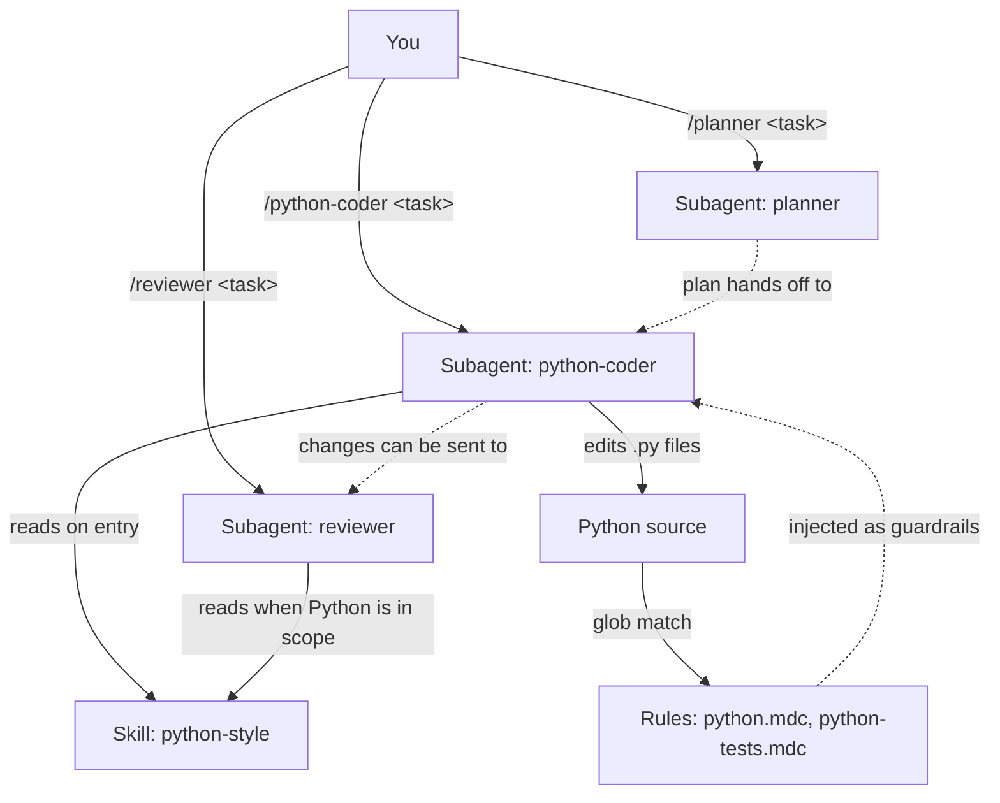

# CouchPilot

A small, opinionated set of Cursor settings (Rules, Skills, and Subagents)
plus a single sync script. Clone the repo on any machine, run `sync.py`, and
your **user-scope** Cursor configuration gains three slash-invokable
subagents that work together as a tight loop:

| Subagent | When | Model | Mode |
|---|---|---|---|
| `/planner` | Turn an ambiguous request into a concrete, file-level plan. | `gpt-5.5` | read-only |
| `/python-coder` | Execute a planned change (or a small ad-hoc one) in Python, in your style. | `default` | foreground or background |
| `/reviewer` | Critique a diff or set of changed files against your style standards. | `gpt-5.5` | read-only, background |

Plus two glob-scoped Rules and one deep Skill that the coder and reviewer
read on entry. No CLI to learn, no pipeline, no memory system, no
project-scope sync.

## What you get

```
CouchPilot/
  .cursor/
    rules/
      python.mdc                  # auto-applies on **/*.py
      python-tests.mdc            # auto-applies on **/tests/**/*.py
    skills/
      python-style/SKILL.md       # the deep "code the way I write code" reference
    agents/
      planner.md                  # invoked via /planner <task>
      python-coder.md             # invoked via /python-coder <task>
      reviewer.md                 # invoked via /reviewer <task>
  sync.py                         # stdlib-only, cross-platform, user-scope only
  README.md
  .gitignore
```

After running `sync.py`, the same files land in your home directory:

```
~/.cursor/
  rules/python.mdc
  rules/python-tests.mdc
  skills/python-style/SKILL.md
  agents/planner.md
  agents/python-coder.md
  agents/reviewer.md
```

Cursor reads from those locations on every workspace, so the rules apply
globally, the skill is auto-discovered by description, and all three slash
commands are available in every chat.

## Quick start

```bash
git clone <this-repo> CouchPilot
cd CouchPilot
python sync.py
```

That's it. Open any Python project in Cursor and use the three subagents
as a workflow loop:

```
/planner add a Loader class that reads bar.json and exposes get(key) with caching
/python-coder execute the plan above
/reviewer review the changes I just made
```

Re-run `sync.py` whenever you update rules, the skill, or the subagents
here. The script is idempotent: it reports each file as `copy`, `overwrite`,
or `skip-identical`. Use `--dry-run` to preview without writing.

```bash
python sync.py --dry-run
```

## Activating changes after sync

Cursor caches user-scope rules, skills, and subagents per chat session.
After running `sync.py`, the new content is on disk, but **any chat that
was already open (and possibly the running IDE itself) still holds the
previous snapshot**. To guarantee a fresh read:

1. Run `python sync.py`.
2. Restart Cursor, or at minimum start a new chat in a new window.

`sync.py` prints this reminder at the end of every real sync, so you
can't miss it.

### Verifying the cache refreshed

Each subagent (`/planner`, `/python-coder`, `/reviewer`) is instructed
to declare its loaded context as the very first thing it does, before
any other work. The line looks like:

```
Loaded: rules = python.mdc, python-tests.mdc; skills = python-style
```

If the subagent reports that an expected rule or skill is missing —
or you see `(none)` — restart Cursor and try again.

### Why a rule might still not appear

Two things to know about Cursor's rule injection:

- Rules with `alwaysApply: true` are injected into every chat. This
  project intentionally does not use that mode for any of its rules.
- Rules with `alwaysApply: false` and a `globs:` value (both
  `python.mdc` and `python-tests.mdc`) only attach when a file matching
  that glob is in the chat's context. If `python.mdc` is missing from
  the loaded list, the most likely cause is that no `*.py` file is open
  or attached. Open one, then re-invoke the subagent.

## The three concepts

The whole project is built on three Cursor primitives. If you remember
nothing else, remember these:



### Rules (`~/.cursor/rules/*.mdc`)

Short, declarative guardrails that Cursor injects automatically when files
match a glob. Think: "what every agent must remember while editing this kind
of file." They are bound to **files**, not to subagents.

- `python.mdc` fires on every `*.py` file. It enforces formatting, typing,
  OOP preference, explicit errors, **and carries the concrete tooling
  baseline values** (line length 100, target py311, max-args 8, max-branches
  15, max-statements 60, etc.).
- `python-tests.mdc` fires only inside `**/tests/**/*.py` and adds pytest
  conventions on top.

You normally do not invoke a rule. It just applies, regardless of which
agent (parent or sub) is doing the editing.

### Skills (`~/.cursor/skills/<name>/SKILL.md`)

Longer reference documents that an agent reads when the task description
matches. Cursor surfaces a skill by reading the `description:` field in its
frontmatter and deciding it is relevant. Skills are bound to **descriptions**,
not to subagents.

In this repo there is one skill, `python-style`, which is the authoritative
"code the way I write code" document. The `/python-coder` subagent reads it
on entry; `/reviewer` reads it when reviewing Python; **any agent** Cursor
decides is relevant can also pick it up. The skill is reusable and not
"owned" by any one subagent.

### Subagents (`~/.cursor/agents/<name>.md`)

Focused personas with their own brief, model, and behavior. They are invoked
explicitly with `/<name> <task>` (slash command) or auto-delegated by the
parent agent based on their `description:` field. They are bound to **tasks**.

| Subagent | Role | Skill it consults | Model | Mode |
|---|---|---|---|---|
| `/planner` | Produce a concrete plan; never writes code. | `python-style` (Python plans) | `gpt-5.5` | `readonly: true` |
| `/python-coder` | Execute Python changes in your style; runs `black` + `pylint`. | `python-style` | `default` | `is_background: true` |
| `/reviewer` | Line-anchored critique of a diff; never edits. | `python-style` (Python diffs) | `gpt-5.5` | `readonly: true`, `is_background: true` |

Each subagent body explicitly tells it which skill to read on entry. That is
a workflow declaration, not a binding — the skill remains available to other
agents Cursor judges relevant.

> **Naming note:** subagent names are intentionally specific (`python-coder`,
> not `python`) for two reasons:
>
> 1. Cursor surfaces both skills and subagents at `/<name>`, so giving them
>    the same name causes routing ambiguity.
> 2. Cursor can also auto-delegate to a subagent based on its description.
>    A subagent named `python` is at risk of being auto-invoked any time a
>    user mentions "python" in casual conversation. `python-coder` is
>    unambiguous: it produces or edits Python code, full stop. Each
>    subagent's description further reinforces "do not delegate for
>    unrelated work."

### Why three things instead of one

Each primitive solves a different problem:

- **Rules** are cheap and always-on. Use them for short guardrails that
  should apply to every edit of a given file type, plus concrete tooling
  values.
- **Skills** are deeper references. Use them when the rule would be too
  long to inject every time, but you still want any relevant agent to
  consult it.
- **Subagents** are personas. Use them when you want a specific *workflow*
  (read skill, do work, report) on demand via a slash command, with its own
  model setting.

Think of it as: rules are reflexes, skills are reference manuals, subagents
are coworkers with a defined job description and a preferred model.

## Daily workflow

The three subagents are designed as a loop:

1. **Plan** the change.
   `/planner add a Loader class that reads bar.json and exposes get(key)`
   You get back a structured plan with goal, decisions, file-level changes,
   tests, risks, and a handoff line.

2. **Implement** it.
   `/python-coder execute the plan above`
   The coder reads `python-style`, resolves the project's quality tooling
   (`make lint` / `ruff` / `pylint` / etc., per skill section 11), runs
   it, and reports the actual results. On the first run in a new project
   it caches its tooling discovery to `.cursor/scratch/tooling.md` so
   future runs are fast; the cache self-invalidates via fingerprint
   whenever any tooling config file changes.

3. **Review** the diff (optional but recommended for non-trivial changes).
   `/reviewer review the changes from the previous step`
   You get line-anchored findings grouped by file, with a verdict. The
   reviewer is read-only and does not run any tools — it critiques what
   you wrote against your style standards. Tool-running stays the coder's
   job.

4. **Iterate** if the reviewer requests changes; loop back to step 2.

You can also use any one subagent on its own — quick edits go straight to
`/python-coder`, ad-hoc reviews go straight to `/reviewer`, big-picture
questions go to `/planner` without committing to implement.

### About `.cursor/scratch/tooling.md`

The first time `/python-coder` runs in an external project, it creates
`.cursor/scratch/tooling.md` (a per-project cache of which formatter,
linter, type-checker, and test command the project actually uses) and a
self-contained `.cursor/scratch/.gitignore` that prevents the cache from
being committed. You don't need to edit either file or the project's
root `.gitignore`. If the project's tooling ever changes (e.g. someone
edits the `Makefile` or swaps `pylint` for `ruff`), the next coder
invocation detects the fingerprint mismatch and re-discovers
automatically.

## Why the planner and reviewer use a stronger model

`/planner` and `/reviewer` both ship with `model: gpt-5.5` (or whichever
high-intelligence slug your Cursor version exposes). The reasoning:

- **Planning** benefits from strong reasoning over many trade-offs at once.
- **Review** benefits from cross-checking the coder. If `default` writes
  the code and `default` reviews it, both share the same blind spots.
  A different (and stronger) model on review catches what the coder missed.

`/python-coder` ships with `model: default` so Cursor picks the appropriate
coding model for each invocation.

If your Cursor accepts a different slug (e.g. `claude-opus-4`,
`claude-3-opus`), edit the `model:` line in the corresponding agent file
in this repo and re-run `python sync.py`.

## Extending it

Adding another language follows the same pattern. To add, for example, a
TypeScript coder:

1. Add `.cursor/rules/typescript.mdc` with `globs: "**/*.ts"` and the
   concrete tooling baselines for TS.
2. Add `.cursor/skills/typescript-style/SKILL.md` (descriptive name, not
   `typescript`, to avoid colliding with the subagent slash command).
3. Add `.cursor/agents/typescript-coder.md` (so `/typescript-coder` is
   invokable). Use `model: default` for coding (so Cursor picks the right
   coding model) and `model: gpt-5.5` (or your Cursor's strongest slug)
   for any planner/reviewer subagents you add alongside it.
4. Re-run `sync.py`.

The naming convention is `<language>-coder` for coding subagents, with
skills named `<language>-style`. Non-language subagents follow the same
role-name pattern (e.g. `/planner`, `/reviewer`) where the name describes
the role specifically enough not to collide with everyday vocabulary.

Resist the urge to add ten more skills or a meta-orchestrator.
Conceptual sprawl is the main failure mode of toolkits like this. Keep
it minimal until something concrete forces a change.

## What this repo intentionally does not do

- No installable Python package, console script, or wrapper CLI.
- No project-scope sync. `sync.py` only writes into `~/.cursor/` so it can
  never overwrite a target repo's checked-in `.cursor/` settings.
- No pipeline, learning cache, or "foundation validator."
- No persistent memory or `~/.cursor/agent-memory/` integration.
- No `.couchpilot/tasks/` workspace.
- No subagents beyond `/planner`, `/python-coder`, and `/reviewer`.
- No `.pylintrc` or `pyproject.toml` templates shipped to target projects;
  the concrete values live in the `python` rule instead.

If a future need genuinely justifies one of these, add it deliberately, in
its own discussion, and document why it earned a place here.
