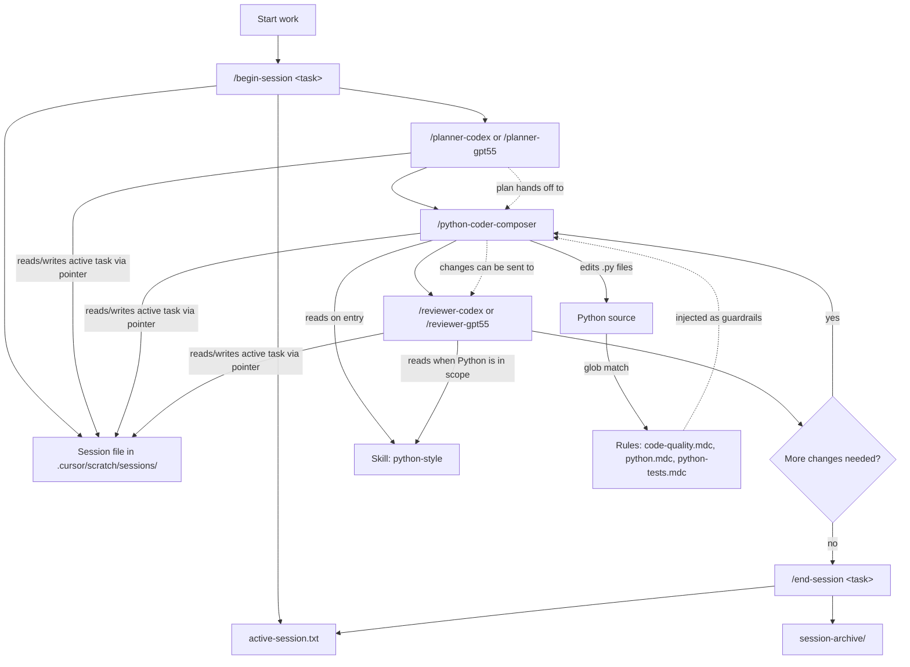

# CouchPilot

A small, opinionated set of Cursor settings (Rules, Skills, and Subagents)
plus a single sync script. Clone the repo on any machine, run `sync.py`, and
your **user-scope** Cursor configuration gains model-specific slash commands
for planning, coding, and review:

| Subagent | When | Model | Mode |
|---|---|---|---|
| `/planner-codex` | Outcome-first planning for implementation tasks. | `gpt-5.3-codex` | scratch-only writer |
| `/planner-gpt55` | Outcome-first planning tuned for GPT-5.5 behavior. | `gpt-5.5` | scratch-only writer |
| `/python-coder-composer` | Python implementation with inspect-first, bounded edits. | `composer-2` | foreground or background |
| `/reviewer-codex` | Line-anchored review tuned for Codex. | `gpt-5.3-codex` | scratch-only writer, background |
| `/reviewer-gpt55` | Risk-first review tuned for GPT-5.5. | `gpt-5.5` | scratch-only writer, background |

Reusable command prompts are also included:
- `/dispatch-subagent` (`.cursor/commands/dispatch-subagent.md`)
- `/begin-session` (`.cursor/commands/begin-session.md`)
- `/end-session` (`.cursor/commands/end-session.md`)
- `/deslop-main-diff` (`.cursor/commands/deslop-main-diff.md`) - optional cleanup pass for slop introduced in this branch (diff vs `main`)
- `/deslop-workspace` (`.cursor/commands/deslop-workspace.md`) - optional workspace-wide slop cleanup pass (not scoped by `git diff main`)

Plus three Rules (one global, two Python-scoped) and one short Skill that the coder and reviewer
read on entry. No CLI to learn, no pipeline, no memory system, no
project-scope sync.

## What you get

```
CouchPilot/
  .cursor/
    rules/
      code-quality.mdc            # always applies (cross-language anti-slop defaults)
      python.mdc                  # auto-applies on **/*.py
      python-tests.mdc            # auto-applies on **/tests/**/*.py
    skills/
      python-style/SKILL.md       # short complement to code-quality.mdc + python.mdc (docs, anti-patterns, reporting)
    agents/
      planner-codex.md            # invoked via /planner-codex <task>
      planner-gpt55.md            # invoked via /planner-gpt55 <task>
      python-coder-composer.md    # invoked via /python-coder-composer <task>
      reviewer-codex.md           # invoked via /reviewer-codex <task>
      reviewer-gpt55.md           # invoked via /reviewer-gpt55 <task>
    commands/
      dispatch-subagent.md        # invoked via /dispatch-subagent <target + task>
      begin-session.md            # invoked via /begin-session task: <id> <description>
      end-session.md              # invoked via /end-session task: <id>
      deslop-main-diff.md         # invoked via /deslop-main-diff
      deslop-workspace.md         # invoked via /deslop-workspace
  sync.py                         # stdlib-only, cross-platform, user-scope only
  README.md
  .gitignore
```

After running `sync.py`, the same files land in your home directory:

```
~/.cursor/
  rules/code-quality.mdc
  rules/python.mdc
  rules/python-tests.mdc
  skills/python-style/SKILL.md
  agents/planner-codex.md
  agents/planner-gpt55.md
  agents/python-coder-composer.md
  agents/reviewer-codex.md
  agents/reviewer-gpt55.md
  commands/dispatch-subagent.md
  commands/begin-session.md
  commands/end-session.md
  commands/deslop-main-diff.md
  commands/deslop-workspace.md
```

Cursor reads from those locations on every workspace, so the rules apply
globally and these model-specific slash commands are available in every chat.

## Quick start

```bash
git clone <this-repo> CouchPilot
cd CouchPilot
python sync.py
```

That's it. Open any Python project in Cursor and use this workflow loop:

```
/planner-codex task: feat-foo-module add a Foo class that reads foo.json and exposes get(key) with caching
/python-coder-composer task: feat-foo-module execute the plan above
/reviewer-gpt55 task: feat-foo-module review the changes I just made
```

### Dispatch command example

Use `/dispatch-subagent` when you want the main thread to delegate with a
minimal, task-focused handoff:

```text
/dispatch-subagent /python-coder-composer task: feat-foo-module resolve reviewer findings above
```

You can swap the target for planner or reviewer variants:

```text
/dispatch-subagent /planner-codex task: feat-foo-module plan the implementation
/dispatch-subagent /reviewer-gpt55 task: feat-foo-module review the latest diff
```

### Session lifecycle commands

Start or switch task context explicitly before subagent work:

```text
/begin-session task: feat-foo-module implement foo workflow plan
```

Close and archive a finished task session:

```text
/end-session task: feat-foo-module completed and merged
```

`/end-session` moves the task file to `session-archive/` and clears the active
pointer.

Re-run `sync.py` whenever you update rules, the skill, or the subagents
here. The script is idempotent: it reports each file as `copy`, `overwrite`,
or `skip-identical`. Use `--dry-run` to preview without writing.

```bash
python sync.py --dry-run
```

## Activating changes after sync

Cursor caches user-scope rules, skills, and subagents per chat session.
After running `sync.py`, the new content is on disk, but **any chat that
was already open (and possibly the running IDE itself) still holds the
previous snapshot**. To guarantee a fresh read:

1. Run `python sync.py`.
2. Restart Cursor, or at minimum start a new chat in a new window.

`sync.py` prints this reminder at the end of every real sync, so you
can't miss it.

### Verifying the cache refreshed

Each subagent (`/planner-codex`, `/planner-gpt55`, `/python-coder-composer`, `/reviewer-codex`, `/reviewer-gpt55`) is instructed
to declare its loaded context as the very first thing it does, before
any other work. The line looks like:

```
Loaded: rules = code-quality.mdc, python.mdc, python-tests.mdc; skills = python-style
```

If the subagent reports that an expected rule or skill is missing —
or you see `(none)` — restart Cursor and try again.

As of this version, the subagents are also instructed to resolve rules
from disk (not only injected context): workspace `.cursor/rules/*.mdc`,
then user-scope `~/.cursor/rules/*.mdc`, plus any user-level rule paths
configured in Cursor settings. This prevents false "missing rule" reports
when the active workspace has no local `.cursor/rules/` folder.

### Why a rule might still not appear

Two things to know about Cursor's rule injection:

- Rules with `alwaysApply: true` are injected into every chat. This
  project intentionally does not use that mode for any of its rules.
- `code-quality.mdc` uses `alwaysApply: true`, so it should appear in every
  coding session.
- Rules with `alwaysApply: false` and a `globs:` value (`python.mdc` and
  `python-tests.mdc`) only attach when a file matching that glob is in the
  chat's context. If `python.mdc` is missing from the loaded list, the most
  likely cause is that no `*.py` file is open or attached. Open one, then
  re-invoke the subagent.

## The four concepts

The whole project is built on four Cursor primitives. If you remember
nothing else, remember these:



### Rules (`~/.cursor/rules/*.mdc`)

Short, declarative guardrails that Cursor injects automatically when files
match a glob. Think: "what every agent must remember while editing this kind
of file." They are bound to **files**, not to subagents.

- `code-quality.mdc` applies globally (`alwaysApply: true`) and carries
  cross-language anti-slop defaults (minimal, idiomatic changes; no noisy
  comments; no speculative defensive branches; no type-escape shortcuts).
- `python.mdc` fires on every `*.py` file. It enforces formatting, typing,
  OOP preference, explicit errors, **and carries the concrete tooling
  baseline values** (line length 100, target py311, max-args 8, max-branches
  15, max-statements 60, etc.).
- `python-tests.mdc` fires only inside `**/tests/**/*.py` and adds pytest
  conventions on top.

You normally do not invoke a rule. It just applies, regardless of which
agent (parent or sub) is doing the editing.

### Skills (`~/.cursor/skills/<name>/SKILL.md`)

Longer reference documents that an agent reads when the task description
matches. Cursor surfaces a skill by reading the `description:` field in its
frontmatter and deciding it is relevant. Skills are bound to **descriptions**,
not to subagents.

In this repo there is one skill, `python-style`, which is the authoritative
"code the way I write code" document. The `/python-coder-composer` subagent reads it
on entry; reviewer variants read it when reviewing Python; **any agent** Cursor
decides is relevant can also pick it up. The skill is reusable and not
"owned" by any one subagent.

### Subagents (`~/.cursor/agents/<name>.md`)

Focused personas with their own brief, model, and behavior. They are invoked
explicitly with `/<name> <task>` (slash command) or auto-delegated by the
parent agent based on their `description:` field. They are bound to **tasks**.

| Subagent | Role | Skill it consults | Model | Mode |
|---|---|---|---|---|
| `/planner-codex` | Produce a concrete plan; never writes code. | `python-style` (Python plans) | `gpt-5.3-codex` | scratch-only (prose-enforced) |
| `/planner-gpt55` | Produce a concrete plan; never writes code. | `python-style` (Python plans) | `gpt-5.5` | scratch-only (prose-enforced) |
| `/python-coder-composer` | Execute Python changes in your style; inspect first, then implement. | `python-style` | `composer-2` | foreground/background |
| `/reviewer-codex` | Line-anchored critique of a diff; never edits code. | `python-style` (Python diffs) | `gpt-5.3-codex` | scratch-only (prose-enforced), background |
| `/reviewer-gpt55` | Line-anchored critique of a diff; never edits code. | `python-style` (Python diffs) | `gpt-5.5` | scratch-only (prose-enforced), background |

Each subagent body explicitly tells it which skill to read on entry. That is
a workflow declaration, not a binding — the skill remains available to other
agents Cursor judges relevant.

> **Naming note:** subagent names are intentionally specific (`python-coder-composer`,
> not `python`) for two reasons:
>
> 1. Cursor surfaces both skills and subagents at `/<name>`, so giving them
>    the same name causes routing ambiguity.
> 2. Cursor can also auto-delegate to a subagent based on its description.
>    A subagent named `python` is at risk of being auto-invoked any time a
>    user mentions "python" in casual conversation. `python-coder-composer` is
>    unambiguous: it produces or edits Python code, full stop. Each
>    subagent's description further reinforces "do not delegate for
>    unrelated work."

### Why four things instead of one

Each primitive solves a different problem:

- **Rules** are cheap and always-on. Use them for short guardrails that
  should apply to every edit of a given file type, plus concrete tooling
  values.
- **Skills** are deeper references. Use them when the rule would be too
  long to inject every time, but you still want any relevant agent to
  consult it.
- **Subagents** are personas. Use them when you want a specific *workflow*
  (read skill, do work, report) on demand via a slash command, with its own
  model setting.
- **Commands** are explicit operators. Use `/begin-session` and `/end-session`
  to control session lifecycle, and `/dispatch-subagent` to enforce minimal,
  task-focused delegation format.

Think of it as: rules are reflexes, skills are reference manuals, subagents
are coworkers with defined jobs, and commands are explicit controls for how
work is started, delegated, and closed.

## Daily workflow

The planning/coding/review loop is tied together by a single
shared task ID. You pass the task ID to every subagent invocation as
`task: <kebab-case-slug>` near the start of the slash command. Subagents read
task context from an explicit active-session pointer and task-scoped files.
Session lifecycle is explicit: start with `/begin-session`, finish with
`/end-session`.

For main-thread orchestration, use `/dispatch-subagent` in each step below.
Each step includes both direct invocation and explicit dispatch form. Keep the
same `task: <slug>` in dispatched requests.

1. **Begin** the task session.

   ```
   /begin-session task: feat-foo-module implement foo workflow plan
   ```

   This creates/reuses the canonical task session file and sets
   `.cursor/scratch/active-session.txt`.

2. **Plan** the change.

   ```
   /dispatch-subagent /planner-codex task: feat-foo-module — add a Foo class that reads foo.json and exposes get(key)
   ```

   You get back a structured plan in chat. Planner updates the active
   task session file selected by `/begin-session`.

   Direct invocation (optional):
   ```
   /planner-codex task: feat-foo-module plan the implementation
   ```

3. **Implement** it.

   ```
   /dispatch-subagent /python-coder-composer task: feat-foo-module execute the approved plan
   ```

   The coder reads the active task session file, finds the matching plan, implements,
   resolves the project's quality tooling (`make lint` / `ruff` /
   `pylint` / etc., per the discovery procedure in
   `~/.cursor/agents/python-coder-composer.md`), runs the gates, and reports
   the actual results. It also appends an iteration log entry to
   the session iteration log listing files touched and gate results.

   Direct invocation (optional):
   ```
   /python-coder-composer task: feat-foo-module execute the plan
   ```

4. **Review** the diff (optional but recommended for non-trivial changes).

   ```
   /dispatch-subagent /reviewer-codex task: feat-foo-module review the latest diff
   ```

   The reviewer reads the active task session file and uses its iteration log to scope
   `git diff` to the files the coder actually touched. It writes
   line-anchored findings into the session file's `# Findings` section and
   prints them in chat. The reviewer does not edit code or
   run any tools.

   Direct invocation (optional):
   ```
   /reviewer-codex task: feat-foo-module review the changes
   ```

5. **Iterate** if the reviewer requests changes:

   ```
   /dispatch-subagent /python-coder-composer task: feat-foo-module address review findings
   ```

   The coder reads the latest Findings from the active task session file, fixes them,
   reports a "Findings addressed" map, and logs another iteration.
   Loop back to step 3 if needed.

   Direct invocation (optional):
   ```
   /python-coder-composer task: feat-foo-module address the review findings
   ```

6. **End** the task session when complete.

   ```
   /end-session task: feat-foo-module completed and merged
   ```

You can also use any one subagent on its own, but they still expect an active
session pointer from `/begin-session` unless you explicitly confirm ad-hoc mode.

### About `.cursor/scratch/tooling.md`

The first time `/python-coder-composer` runs in an external project, it creates
`.cursor/scratch/tooling.md` (a per-project cache of which formatter,
linter, type-checker, and test command the project actually uses) and a
self-contained `.cursor/scratch/.gitignore` that prevents the cache from
being committed. You don't need to edit either file or the project's
root `.gitignore`. If the project's tooling ever changes (e.g. someone
edits the `Makefile` or swaps `pylint` for `ruff`), the next coder
invocation detects the fingerprint mismatch and re-discovers
automatically.

### About `.cursor/scratch/sessions/*.md` and `active-session.txt`

Cursor subagents are stateless one-shots: each invocation starts with a
fresh context and does not see the parent chat or prior subagent runs.
To bridge that gap without third-party memory tools, this project uses
task-scoped scratch files as canonical handoff records, selected by an explicit
active pointer.

- Canonical session: `.cursor/scratch/sessions/<task_id>__<sanitized-branch>__<git-short-sha>.md`
- Active pointer: `.cursor/scratch/active-session.txt`

**The schema** (created by planner variants, read by planner/reviewer/coder
variants):

```
---
task_id: feat-foo-module
started_at: 2026-05-10T04:02:00-04:00
last_updated: 2026-05-10T04:15:00-04:00
last_agent: python-coder-composer
status: in-progress
git_ref: feature/p1-03@a1b2c3d
---

# Task
<one-line task statement>

# Plan
<structured plan from planner variant; may have v2, v3 sections on iteration>

# Findings
<reviewer variant overwrites this each review run>

# Project notes
<agents append discovered conventions; do not paste source>

# Iteration log
- <ISO8601> [planner]      Plan v1 written.
- <ISO8601> [python-coder-composer] Implemented Foo module.
  files_touched: src/foo/loader.py, tests/unit/test_loader.py
  gates: pylint clean, pytest 5/5 pass
- <ISO8601> [reviewer]     request changes — 2 blocking, 1 suggestion
```

**Lifecycle rules:**

- **No automatic archive/discard/switching.** Session changes are explicit via
  `/begin-session` and `/end-session`.
- **Planner updates plan sections.** On RESUME it appends `v2`, `v3`, etc.; on
  REPLACE it rewrites the plan section.
- **Coder appends.** Each implementation run adds an iteration log
  entry and may append to Project notes. It never overwrites existing
  sections.
- **Reviewer overwrites Findings, appends a log entry.** Findings
  always reflect the most recent review; we do not accumulate stale
  ones. The iteration log preserves history.
- **`tooling.md`, `active-session.txt`, and `sessions/*.md` are gitignored** by the
  self-contained `.cursor/scratch/.gitignore` that the agents
  auto-create. Nothing in `.cursor/scratch/` ever gets committed to the
  target project.

**What this is and isn't:**

- It IS a token-saving handoff between successive subagent runs:
  reviewer findings flow to coder without the user copy-pasting, plans
  flow to coder the same way, and project conventions discovered
  during one iteration are available to the next.
- It IS NOT vector memory, semantic search, or cross-task memory. One
  task at a time, plain markdown.
- Cursor's parent chat still doesn't share state with subagents. Session files
  bridge subagent runs. If you want the parent chat to see the same context,
  paste the relevant section of the active task session file
  into the chat manually — there is no automatic propagation.

**Forgotten task ID:** if you invoke a subagent without `task: <slug>`,
the agent will flag the missing or mismatched task ID and ask before
proceeding rather than silently use the wrong context.

## Why we ship model-specific variants

Planner and reviewer prompts are provided in both Codex and GPT-5.5 variants,
while coding uses a Composer-tuned variant. The reasoning:

- **Cross-checking implementation.** Planning/review on models different from
  the coding model can catch blind spots.
- **Prompt specialization.** Each variant is tuned to the model's prompt
  guidance rather than forcing one instruction style across all models.
- **Flexibility.** You can choose Codex vs GPT-5.5 planning/review per task.

`/python-coder-composer` ships with `model: composer-2` for a stable,
inspect-first coding workflow.

If your Cursor exposes different slugs, edit each agent file's `model:` line
and re-run `python sync.py`.

## Extending it

Adding another language follows the same pattern. To add, for example, a
TypeScript coder:

1. Add `.cursor/rules/typescript.mdc` with `globs: "**/*.ts"` and the
   concrete tooling baselines for TS.
2. Add `.cursor/skills/typescript-style/SKILL.md` (descriptive name, not
   `typescript`, to avoid colliding with the subagent slash command).
3. Add `.cursor/agents/typescript-coder.md` (so `/typescript-coder` is
   invokable). Use `model: default` for coding (so Cursor picks the
   right coding model). For any planner/reviewer subagents you add
   alongside it, prefer a code-tuned but cost-aware model like
   `gpt-5.3-codex` (or whatever your Cursor exposes that fits the same
   tradeoff).
4. Re-run `sync.py`.

The naming convention is `<language>-coder` for coding subagents, with
skills named `<language>-style`. Non-language subagents follow the same
role-name pattern (e.g. `/planner-codex`, `/reviewer-codex`) where the name describes
the role specifically enough not to collide with everyday vocabulary.

Resist the urge to add ten more skills or a meta-orchestrator.
Conceptual sprawl is the main failure mode of toolkits like this. Keep
it minimal until something concrete forces a change.

## What this repo intentionally does not do

- No installable Python package, console script, or wrapper CLI.
- No project-scope sync. `sync.py` only writes into `~/.cursor/` so it can
  never overwrite a target repo's checked-in `.cursor/` settings.
- No pipeline, learning cache, or "foundation validator."
- No persistent memory or `~/.cursor/agent-memory/` integration.
- No `.couchpilot/tasks/` workspace.
- No subagents beyond the current model-specific planner/reviewer/coder set.
- No `.pylintrc` or `pyproject.toml` templates shipped to target projects;
  the concrete values live in the `python` rule instead.

If a future need genuinely justifies one of these, add it deliberately, in
its own discussion, and document why it earned a place here.
